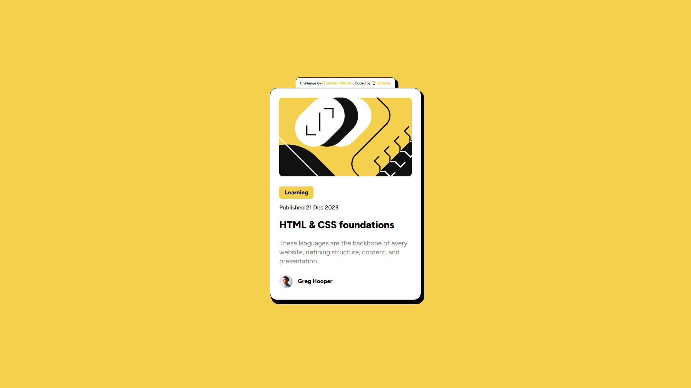
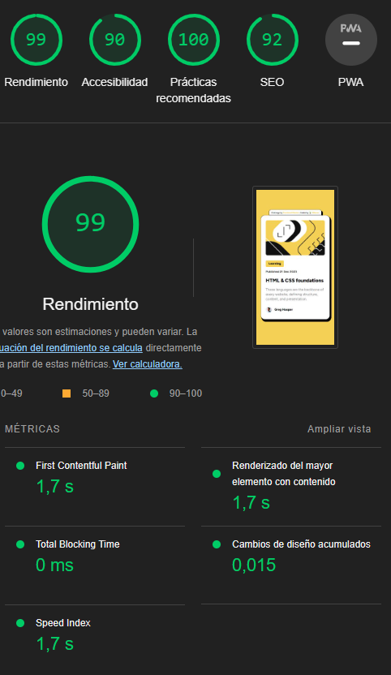

# Frontend Mentor - Social links profile solution

This is a solution to the [blog preview card challenge on Frontend Mentor](https://www.frontendmentor.io/challenges/blog-preview-card-ckPaj01IcS). Frontend Mentor challenges help you improve your coding skills by building realistic projects. 

##  📝 Table of contents

- [Frontend Mentor - Social links profile solution](#frontend-mentor---social-links-profile-solution)
  - [📝 Table of contents](#-table-of-contents)
  - [⭐ Overview](#-overview)
    - [📷 Screenshot](#-screenshot)
    - [📷 Lighthouse](#-lighthouse)
    - [Links](#links)
  - [⭐ My process](#-my-process)
    - [Built with](#built-with)
  - [⭐Author](#author)

## ⭐ Overview

###  📷 Screenshot

###  📷 Lighthouse

###  Links

- Solution URL: [GitHub](https://github.com/Dllanw/blog-preview-card-main)
- Live Site URL: [Netlify](https://blog-preview-card-dllanw.netlify.app/)

## ⭐ My process

###  Built with

- Semantic HTML5 markup
- CSS custom properties
- Flexbox
- @media

## ⭐Author

- 🌱 Website - **in process**
- 🌱 Frontend Mentor - [@Dllanw](https://www.frontendmentor.io/profile/Dllanw)
